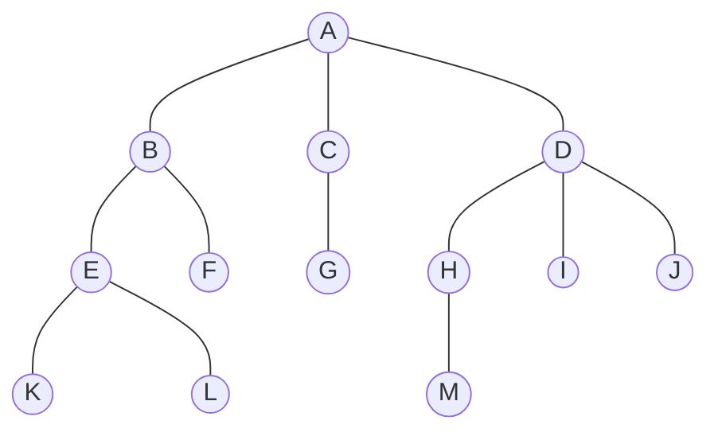

# 数算笔记

## 1.排序

### 冒泡排序（Bubble Sort）

从左向右依次比较，大的放在右边，若逆序，则交换位置，所以每一遍排序会将最大的移动到最右边。

```python
def bubbleSort(arr):
    n = len(arr)
    for i in range(n):
        swapped = False
        for j in range(0, n - i - 1):
            if arr[j] > arr[j + 1]:
                arr[j], arr[j + 1] = arr[j + 1], arr[j]
                swapped = True
        if (swapped == False):
            break #确定排序已经完成，就结束排序。
arr = [64, 34, 25, 12, 22, 11, 90]
bubbleSort(arr)
print(' '.join(map(str, arr)))
```

冒泡排序的时间复杂度：最坏O($n^2$)  平均O($n^2$)  最好O($n^2$​)

使用的辅助空间为O(1)

**冒泡排序的优点：**

- 冒泡排序易于理解和实现。
- 它不需要任何额外的内存空间。
- 它是一种稳定的排序算法，这意味着具有相同键值的元素在排序输出中保持其相对顺序。

**冒泡排序的缺点：**

- 冒泡排序的时间复杂度为 O(N2)，这使得它对于大型数据集非常慢。
- 冒泡排序是一种基于比较的排序算法，这意味着它需要一个比较运算符来确定输入数据集中元素的相对顺序。在某些情况下，它会限制算法的效率。

**Q：**假设您有以下要排序的数字列表：[19, 1, 9, 7, 3, 10, 13, 15, 8, 12]哪个列表代表经过三次完整的冒泡排序后的部分排序列表？ （ B ）

A： [1, 9, 19, 7, 3, 10, 13, 15, 8, 12] B： **[1, 3, 7, 9, 10, 8, 12, 13, 15, 19]**

C： [1, 7, 3, 9, 10, 13, 8, 12, 15, 19] D：[1, 9, 19, 7, 3, 10, 13, 15, 8, 12]

### 选择排序(Selection sort)

**选择排序**是一种简单而有效的排序算法，其工作原理是反复从列表的未排序部分中选择最小（或最大）元素并将其移动到列表的已排序部分。该算法反复从列表的未排序部分中选择最小（或最大）元素，并将其与未排序部分的第一个元素交换。对剩余的未排序部分重复此过程，直到整个列表排序完毕。

与冒泡排序相比，选择排序每次遍历只需要一次排序。在每次遍历时找到最大值，将其放到未排序的最后，共需要n-1次。

```python
def selectionSort(alist):
    for fillslot in range(len(alist)-1, 0, -1):
        positionOfMax = 0
        for location in range(1, fillslot+1):
            if alist[location] > alist[positionOfMax]:
                positionOfMax = location

        if positionOfMax != fillslot:
            alist[fillslot], alist[positionOfMax] = alist[positionOfMax], alist[fillslot]

alist = [54, 26, 93, 17, 77, 31, 44, 55, 20]
selectionSort(alist)
print(alist)

# [17, 20, 26, 31, 44, 54, 55, 77, 93]
```

**选择排序的复杂性分析** 

时间复杂性：任何情况下都是O($n^2$)

辅助空间：O(1)，因为在数组中交换两个值时，唯一使用的额外内存是用于临时变量。选择排序的交换次数永远不会超过 O(N)，并且在内存写入成本高昂时非常有用。

**选择排序算法的优点**  简单易懂,适用于小型数据集。

**选择排序算法的缺点**  在最坏和平均情况下，选择排序的时间复杂度为 O($n^2$)

不适用于大型数据集。 

 不保留具有相等键的项目的相对顺序，这意味着它不稳定。

**问：**假设您有以下要排序的数字列表：[11, 7, 12, 14, 19, 1, 6, 18, 8, 20]哪个列表代表经过三次完整的选择排序后的部分排序列表？ （D）

A. [7, 11, 12, 1, 6, 14, 8, 18, 19, 20]
B. [7, 11, 12, 14, 19, 1, 6, 18, 8, 20]
C. [11, 7, 12, 14, 1, 6, 8, 18, 19, 20]
D. **[11, 7, 12, 14, 8, 1, 6, 18, 19, 20]**

### 插入排序（Insertion Sort）

**插入排序**是一种简单的排序演算法，它的工作原理是迭代未排序列表的每个元素插入到列表的已排序部分中的正确位置。它是一种**稳定的排序**演算法，这意味着具有有价值的元素在排序输出中保持其相对顺序。

**插入排序**就好比是对你手中的手动牌进行排序。您将调整调整：已排序的调整和未排序的调整。然后，未排序的货架中挑选一张卡，将其放置在已排序的群组中正确的位置。

```python
def insertionSort(arr):
    for i in range(1, len(arr)):

        key = arr[i]
        j = i-1
        while j >= 0 and key < arr[j] :
                arr[j + 1] = arr[j]
                j -= 1
        arr[j + 1] = key
arr = [12, 11, 13, 5, 6]
insertionSort(arr)
for i in range(len(arr)):
    print ("% d" % arr[i])
```

**时间复杂度：**

最好 O(n)   平均O($n^2$)   最坏O($n^2$​)

**辅助空间：**O(1)

**插入排序的优点**

且简单易实施。

稳定的排序算法。

对于小列表和近排序列表非常有效。

节省空间。

**插入排序的缺点**

对于大型清单效率低下。

大多数情况下，不如其他排序算法（例如，合并排序、快速排序）有效率。

**插入排序的应用**

该列表已排序或几乎已排序。

简单性和稳定性很重要。

### 快速排序（Quick Sort）

快速排序的基本思想：

选择一个标准，把被排序序列中的记录按这一标准分为大小两组。

采用同样的方式，递归地分别划分得到的这两组记录，并继续递归地划分下去。

不断划分将得到越来越小的分组（可能越来越多），如此工作下去，知道每个记录组中最多包含一个记录时，整个序列的排序完成。

```python
def quicksort(arr, left, right):
    if left < right:
        partition_pos = partition(arr, left, right)
        quicksort(arr, left, partition_pos - 1)
        quicksort(arr, partition_pos + 1, right)

def partition(arr, left, right):
    i = left
    j = right - 1
    pivot = arr[right] #取最后一个数为中间数
    while i <= j:
        while i <= right and arr[i] < pivot: #对于i处的数，如果其在范围内，且该数小于中间数，则判断下一个
            i += 1
        while j >= left and arr[j] >= pivot: #对于i处的数，如果其在范围内，且该数小于中间数，则判断下一个
            j -= 1
        if i < j: #将左侧小的数和右侧大的数交换位置
            arr[i], arr[j] = arr[j], arr[i]
    if arr[i] > pivot: #将中间数换到i处
        arr[i], arr[right] = arr[right], arr[i]
    return i #返回中间数

arr = [22, 11, 88, 66, 55, 77, 33, 44]
quicksort(arr, 0, len(arr) - 1)
print(arr)

# [11, 22, 33, 44, 55, 66, 77, 88]
```

**时间复杂度**: 最好O(nlogn)   平均O(nlogn)   最坏O($n^2$)

**空间复杂度**：O(logn)

**快速排序的优点：**

它是一种分而治之的算法，可以更轻松地解决问题。 

 它对大型数据集很有效。

它的开销很低，因为它只需要少量内存即可运行。 

**快速排序的缺点：**

它的最坏情况时间复杂度为 $O(N^2)$，当枢轴选择不当时就会发生这种情况。 

它不是小型数据集的好选择。

它不是一种稳定的排序，这意味着如果两个元素具有相同的键，在快速排序的情况下，它们的相对顺序将不会保留在排序输出中，因为这里我们根据枢轴的位置交换元素（不考虑它们的原始位置）。

**Q.** 给定以下数字列表 [14, 17, 13, 15, 19, 10, 3, 16, 9, 12]，选择最左边的元素作为枢轴，哪个答案显示根据快速排序算法第二次分区后的列表内容？（D）

A. [9, 3, 10, 13, 12]
B. [9, 3, 10, 13, 12, 14]
C. [9, 3, 10, 13, 12, 14, 17, 16, 15, 19]
**D. [9, 3, 10, 13, 12, 14, 19, 16, 15, 17]**

第一次分区适用于整个列表，第二次分区适用于左侧分区，而不是右侧分区。重要的是要记住，快速排序适用于整个列表并对其进行排序。

**Q:** 给定以下数字列表 [1, 20, 11, 5, 2, 9, 16, 14, 13, 19]，使用 3 中位数方法的第一个枢轴值是什么？（B）

A. 1
**B. 9**
C. 16
D. 19

虽然 16 是 1、16、19 的中位数，但中间位于 len(list) // 2。

三中位数法：枢纽值取第一个数、最后一个数、中间数的中位数。

**Q:** 即使在最坏的情况下，以下哪种排序算法也能保证 O(n log n)？（C）

A. 希尔排序

B. 快速排序

**C. 归并排序**

D. 插入排序

### 归并排序（Merge Sort）

归并排序的基本思想：

初始时，把待排序序列中的n个记录看成n个有序子序列，每个子序列的长度为1

把当时的有序子序列两两归并，做完一遍使有序序列个数减半，每个序列的长度加倍。

重复归并，直至得到一个长度为n的有序序列。

```python
def mergeSort(arr):
	if len(arr) > 1:
		mid = len(arr)//2 #找到其中间值，对半划分
		L = arr[:mid]
		R = arr[mid:]
		mergeSort(L) #递归两个小序列
		mergeSort(R) 
		i = j = k = 0
		while i < len(L) and j < len(R):
			if L[i] <= R[j]: #此时的L和R已经排好序了
				arr[k] = L[i]
				i += 1
			else:
				arr[k] = R[j]
				j += 1
			k += 1
		while i < len(L): #上个循环在i或j达到长度时停止，需要对后面的进行排序
			arr[k] = L[i]
			i += 1
			k += 1
		while j < len(R):
			arr[k] = R[j]
			j += 1
			k += 1

if __name__ == '__main__':
	arr = [12, 11, 13, 5, 6, 7]
	mergeSort(arr)
	print(' '.join(map(str, arr)))
# Output: 5 6 7 11 12 13
```

时间复杂度：O(Nlog(N))，归并排序总是将组数分成两半

空间复杂度：O(N)

**归并排序应用:**

对大型数据集进行排序:归并排序特别适合于对大型数据集进行排序，因为它保证了最坏情况下的时间复杂度为O(n log n)。

外部排序:合并排序通常用于外部排序，当要排序的数据太大而无法装入内存时。

自定义排序:合并排序可以适应处理不同的输入分布，如部分排序，几乎排序，或完全未排序的数据。

**归并排序优点:**

稳定性:归并排序是一种稳定的排序算法，它保持输入数组中相等元素的相对顺序。

保证的最坏情况性能:归并排序的最坏情况时间复杂度为O(N logN)，这意味着它即使在大数据集上也能表现良好。

并行化:归并排序是一种自然的并行化算法，这意味着它可以很容易地并行化，以利用多个处理器或线程。

**归并排序的缺点:**

空间复杂度:归并排序在排序过程中需要额外的内存来存储合并后的子数组。

非就地排序:归并排序不是就地排序算法，这意味着它需要额外的内存来存储排序后的数据。在关注内存使用的应用程序中，这可能是一个缺点。

对于小数据集并不总是最优的:对于小数据集，合并排序比其他一些排序算法(如插入排序)具有更高的时间复杂度。对于非常小的数据集，这可能导致性能变慢。

**Q:** 给定排序列表 [21,1,26,45,29,28,2,9,16,49,39,27,43,34,46,40]，在归并排序的第 3 次递归调用时，排序的是哪个子表? （ B ）

A： [16, 49,39,27,43,34,46,40]	B： **[21,1]**	C： [21,1,26,45]	D：[21]

记住，在列表的左半部分完全排序之前，归并排序不会对列表的右半部分起作用。

**Q:** 排序数据同上，归并排序中，哪两个子表是最先归并的?（ C ）

A： [21,1] and [26,45]	B：[1, 2, 9,21,26,28,29,45] and [16,27,34,39,40,43, 46,49] 	

C： **[21] and [1]**	D：[9] and [16]

### 希尔排序（Shell Sort）

希尔排序主要是**插入排序**的一种变体。在插入排序中，我们只将元素向前移动一个位置。当一个元素必须向前移动很远时，就会涉及许多移动。希尔排序的思想是允许交换远处的项目。在希尔排序中，我们让数组 h 排序，以获得较大的 h 值。我们不断减少 h 的值，直到它变为 1。如果每个第 h 个元素的所有子列表都已排序，则称该数组是 h 排序的。

步骤 1 - 开始
步骤 2 - 初始化间隙大小的值。示例：h
步骤 3 - 将列表划分为较小的子部分。每个子部分必须与 h 具有相等的间隔
步骤 4 - 使用插入排序对这些子列表进行排序
步骤 5 - 重复此步骤 2，直到列表排序完毕。
步骤 6 - 打印排序后的列表。
步骤 7 - 停止

```python
def shellSort(arr, n):
    gap = n // 2
    while gap > 0:
        j = gap
        while j < n:
            i = j - gap 
            while i >= 0:
                if arr[i + gap] > arr[i]:
                    break
                else:
                    arr[i + gap], arr[i] = arr[i], arr[i + gap]
                i = i - gap
            j += 1
        gap = gap // 2
arr2 = [12, 34, 54, 2, 3]
shellSort(arr2, len(arr2))
print(' '.join(map(str, arr2)))

# Output: 2 3 12 34 54
```

**时间复杂度：**上述希尔排序实现的时间复杂度为 $O(n^2)$。

 **最坏情况复杂度**
希尔排序的最坏情况复杂度为 $O(n^2)$

**希尔排序应用**

替代插入排序，完成给定任务需要很长时间。

要调用堆栈开销，我们使用希尔排序。

当递归超过特定限制时，我们使用希尔排序。

适用于中型到大型数据集。

在插入排序中减少操作数。

与**插入排序**不同，希尔排序不是一种**稳定排序**，因为间隙插入会将相等的元素传输到彼此之间，从而失去其原始顺序。它是一种**自适应排序算法**，因为当输入部分排序时，它的执行速度更快。 **稳定排序**算法按相等元素在输入中出现的顺序对其进行排序。

**问：**给定以下数字列表：[5、16、20、12、3、8、9、17、19、7] 哪个答案说明了在间隙大小为 3 的情况下完成所有交换后列表的内容？ （A）

**A。 [5, 3, 8, 7, 16, 19, 9, 17, 20, 12]**
B. [3, 7, 5, 8, 9, 12, 19, 16, 20, 17]
C. [3, 5, 7, 8, 9, 12, 16, 17, 19, 20]
D. [5, 16, 20, 3, 8, 12, 9, 17, 20, 7]


## 2.基本数据结构

### 线性表

**线性表**是一种逻辑结构，描述了元素按线性顺序排列的规则。常见的线性表存储方式有**数组**和**链表**，它们在不同场景下具有各自的优势和劣势。

数组是一种连续存储结构，它将线性表的元素按照一定的顺序依次存储在内存中的连续地址空间上。数组需要预先分配一定的内存空间，每个元素占用相同大小的内存空间，并可以通过索引来进行快速访问和操作元素。访问元素的时间复杂度为O(1)，因为可以直接计算元素的内存地址。然而，插入和删除元素的时间复杂度较高，平均为O(n)，因为需要移动其他元素来保持连续存储的特性。

**链表**是一种存储结构，它是线性表的链式存储方式。链表通过节点的相互链接来实现元素的存储。每个节点包含元素本身以及指向下一个节点的指针。链表的插入和删除操作非常高效，时间复杂度为O(1)，因为只需要调整节点的指针。然而，访问元素的时间复杂度较高，平均为O(n)，因为必须从头节点开始遍历链表直到找到目标元素。

选择使用数组还是链表作为存储方式取决于具体问题的需求和限制。如果需要频繁进行随机访问操作，数组是更好的选择。如果需要频繁进行插入和删除操作，链表更适合。通过了解它们的特点和性能，可以根据实际情况做出选择。

### 队列和栈

队列和栈是两种重要的数据结构，它们具有push k和pop操作。push k是将数字k加入到队列或栈中，pop则是从队列和栈取一个数出来。队列和栈的区别在于取数的位置是不同的。

队列是先进先出的：把队列看成横向的一个通道，则push k是将k放到队列的最右边，而pop则是从队列的最左边取出一个数。

栈是后进先出的：把栈也看成横向的一个通道，则push k是将k放到栈的最右边，而pop也是从栈的最右边取出一个数。

假设队列和栈当前从左至右都含有1和2两个数，则执行push 5和pop操作示例图如下：

​     push 5     pop

队列 1 2 -------> 1 2 5 ------> 2 5

​     push 5     pop

栈  1 2 -------> 1 2 5 ------> 1 2

### 栈的基本操作

stack():创造一个新的栈

push(item)：将一个项目压入栈中

pop():将栈顶的元素弹出，返回该被弹出的元素

peek():返回栈顶元素

isEmpty():判断栈是否为空

size():返回栈的元素数

| **Stack Operation** | **Stack Contents**   | **Return Value** |
| :------------------ | :------------------- | :--------------- |
| `s.isEmpty()`       | `[]`                 | `True`           |
| `s.push(4)`         | `[4]`                |                  |
| `s.push('dog')`     | `[4,'dog']`          |                  |
| `s.peek()`          | `[4,'dog']`          | `'dog'`          |
| `s.push(True)`      | `[4,'dog',True]`     |                  |
| `s.size()`          | `[4,'dog',True]`     | `3`              |
| `s.isEmpty()`       | `[4,'dog',True]`     | `False`          |
| `s.push(8.4)`       | `[4,'dog',True,8.4]` |                  |
| `s.pop()`           | `[4,'dog',True]`     | `8.4`            |
| `s.pop()`           | `[4,'dog']`          | `True`           |
| `s.size()`          | `[4,'dog']`          | `2`              |

```python
class Stack:
    def __init__(self):
        self.items = []
    
    def is_empty(self):
        return self.items == []
    
    def push(self, item):
        self.items.append(item)
    
    def pop(self):
        return self.items.pop()
    
    def peek(self):
        return self.items[len(self.items)-1]
    
    def size(self):
        return len(self.items)

s = Stack()

print(s.is_empty())
s.push(4)
s.push('dog')

print(s.peek())
s.push(True)
print(s.size())
print(s.is_empty())
s.push(8.4)
print(s.pop())
print(s.pop())
print(s.size())

"""
True
dog
3
False
8.4
True
2
"""
```

实际编程中一般使用系统中自带的list。

#### 一个栈的具体应用：将10进制数转化为8进制

```python
n = int(input())
stack = []
a = n%8
b = n//8
stack.append(a)
while b>0:
    a = b%8
    b = b//8
    stack.append(a)
ans = [0]*len(stack)
for i in range(len(stack)):
    ans[i] = stack[-1-i]
print(''.join(map(str,ans)))
```

#### 例子2：中序表达式转化为后序表达式

思路：

一个最简单的两原子中序表达式，转换成后序表达式时，原子顺序不变。 因此复杂的中序表达式，转换成后序表达式时，原子顺序也不变。

用列表result存放转换的结果，则扫描中序表达式时，碰到原子，就添加到result。

每个运算符都有两个操作数，操作数为原子或带括号的中序表达式。扫描时碰到运算符，不能直接将其添加到result（因为其第二个操作数还未出现），应存放在某处(栈中），以便合适的时候找出来添加到result。

扫描到运算符a时，如果发现栈顶的运算符优先级不低于a，则将栈顶运算符添加到result（此刻result的尾部应该是一个原子或者一个刚生成的后序表达式)，直到栈为空或者栈顶运算符优先级低于 a或栈顶为"("，然后将a入栈。

扫描结束时，将栈中所有元素取出添加到result。

```python
def midToSuffix(s):
    s = s.split()
    stack = []
    result = []
    priority = {"/":1,"*":1,"+":2,"-":2}
    for x in s:
        if x == "(":
            stack.append(x)
        elif x == ")":
            while stack[-1] != "(":
                result.append(stack.pop())
            stack.pop()
        elif x in "/*+-":
            while len(stack) >= 1 and stack[-1] != "(" \
                  and priority[stack[-1]] <= priority[x]:
                result.append(stack.pop())
            stack.append(x)
        else:
            result.append(x)
    while stack != []:
        result.append(stack.pop())
    return " ".join(map(str,result))

s = input()
print(midToSuffix(s))
```

### 队列的基本操作

| **Queue Operation** | **Queue Contents**   | **Return Value** |
| :------------------ | :------------------- | :--------------- |
| `q.isEmpty()`       | `[]`                 | `True`           |
| `q.enqueue(4)`      | `[4]`                |                  |
| `q.enqueue('dog')`  | `['dog',4]`          |                  |
| `q.enqueue(True)`   | `[True,'dog',4]`     |                  |
| `q.size()`          | `[True,'dog',4]`     | `3`              |
| `q.isEmpty()`       | `[True,'dog',4]`     | `False`          |
| `q.enqueue(8.4)`    | `[8.4,True,'dog',4]` |                  |
| `q.dequeue()`       | `[8.4,True,'dog']`   | `4`              |
| `q.dequeue()`       | `[8.4,True]`         | `'dog'`          |
| `q.size()`          | `[8.4,True]`         | `2`              |

```python
class Queue:
    def __init__(self):
        self.items = []

    def is_empty(self):
        return self.items == []

    def enqueue(self, item):
        self.items.insert(0, item)

    def dequeue(self):
        return self.items.pop()

    def size(self):
        return len(self.items)
```

#### 例子1：约瑟夫问题

implementation, http://cs101.openjudge.cn/practice/02746

```python
while True:
    n,m = [int(a) for a in input().split()]
    if n==0 and m==0:
        break
    li = []
    for i in range(1,n+1):
        li.append(i)
    x = 0
    while len(li) != 1:
        a = li[0]
        li.pop(0)
        x = x+1
        if x==m:
            x = 0
            continue
        li.append(a)
    print(li[0])
```

### 双端队列

与栈和队列不同的是，双端队列的限制很少。双端队列是与队列类似的有序集合。它有一前、一后两端，元素在其中保持自己的位置。与队列不同的是，双端队列对在哪一端添加和移除元素没有任何限制。新元素既可以被添加到前端，也可以被添加到后端。同理，已有的元素也能从任意一端移除。

#### 例子1： 双端队列

http://cs101.openjudge.cn/practice/05902/

```python
t = int(input())
for _ in range(t):
    n = int(input())
    dp = []
    for i in range(n):
        a,b = [int(a) for a in input().split()]
        if a == 1:
            dp.append(b)
        if a == 2:
            if b == 0:
                dp.pop(b)
            if b == 1:
                dp.pop(-b)
    if len(dp) == 0:
        print('NULL')
    else:
        print(' '.join(map(str,dp)))
```

### 链表

链表是一种常见的数据结构，用于存储和组织数据。它由一系列节点组成，每个节点包含一个数据元素和一个指向下一个节点（或前一个节点）的指针。

在链表中，每个节点都包含两部分：

1. 数据元素（或数据项）：这是节点存储的实际数据。可以是任何数据类型，例如整数、字符串、对象等。

2. 指针（或引用）：该指针指向链表中的下一个节点（或前一个节点）。它们用于建立节点之间的连接关系，从而形成链表的结构。

根据指针的类型和连接方式，链表可以分为不同类型，包括：

1. 单向链表（单链表）：每个节点只有一个指针，指向下一个节点。链表的头部指针指向第一个节点，而最后一个节点的指针为空（指向 `None`）。

2. 双向链表：每个节点有两个指针，一个指向前一个节点，一个指向后一个节点。双向链表可以从头部或尾部开始遍历，并且可以在任意位置插入或删除节点。

3. 循环链表：最后一个节点的指针指向链表的头部，形成一个环形结构。循环链表可以从任意节点开始遍历，并且可以无限地循环下去。

链表相对于数组的一个重要特点是，链表的大小可以动态地增长或缩小，而不需要预先定义固定的大小。这使得链表在需要频繁插入和删除元素的场景中更加灵活。

然而，链表的访问和搜索操作相对较慢，因为需要遍历整个链表才能找到目标节点。与数组相比，链表的优势在于插入和删除操作的效率较高，尤其是在操作头部或尾部节点时。因此，链表在需要频繁插入和删除元素而不关心随机访问的情况下，是一种常用的数据结构。

l

## 3.树

### 1.属于与定义

**节点 Node**：节点是树的基础部分。
每个节点具有名称，或“键值”。节点还可以保存额外数据项，数据项根据不同的应用而变。

**边 Edge**：边是组成树的另一个基础部分。
每条边恰好连接两个节点，表示节点之间具有关联，边具有出入方向；
每个节点（除根节点）恰有一条来自另一节点的入边；
每个节点可以有零条/一条/多条连到其它节点的出边。<u>如果加限制不能有 “多条边”，这里树结构就特殊化为线性表</u>

**根节 Root**: 树中唯一没有入边的节点。

**路径 Path**：由边依次连接在一起的有序节点列表。比如，哺乳纲→食肉目→猫科→猫属→家猫就是一条路径。

**子节点 Children**：入边均来自于同一个节点的若干节点，称为这个节点的子节点。

**父节点 Parent**：一个节点是其所有出边连接节点的父节点。

**兄弟节点 Sibling**：具有同一父节点的节点之间为兄弟节点。

**子树 Subtree**：一个节点和其所有子孙节点，以及相关边的集合。

**叶节点 Leaf Node**：没有子节点的节点称为叶节点。

**层级 Level**：
从根节点开始到达一个节点的路径，所包含的边的数量，称为这个节点的层级。
如图 D 的层级为 2，根节点的层级为 0。

### 2.树的表达方式

树是n (n>=0) 个结点的有限集。在任意一棵非空树中：
（1）有且仅有一个根结点；（2）除根结点外，其余的结点可分为m(m>=0)个互不相交的子树。


树的表示方法包括

（1）嵌套括号表示法 Nested parentheses representation

是一种表示树结构的方法，通过括号的嵌套来表示树的层次关系。

先将根结点放入一对圆括号中，然后把它的子树按由左而右的顺序放入括号中，而对子树也采用同样方法处理：同层子树与它的根结点用圆括号括起来，同层子树之间用逗号隔开，最后用闭括号括起来。例如下图可写成如下形式
$(a(b,c,d,e))$
    a
/ | | \
b c d e


（2）树形表示

Node-Based or Node-Link structure
In computer science, a general tree is typically represented using this data structure. Each node in the tree contains information and references (links) to its child nodes.



它的嵌套括号表示为：

$(A(B(E(K,L),F),C(G),D(H(M),I,J))$​


（3）文氏图（Venn diagram）

Venn图是在所谓的集合论（或者类的理论）数学分支中，在不太严格的意义下用以表示集合（或类）的一种草图。


（4）凹入表（Indented Tree Representation）


（5）邻接表表示法（Adjacency List Representation）是一种常见的树的表示方法，特别适用于表示稀疏树（树中节点的度数相对较小）。

在邻接表表示法中，使用一个数组来存储树的节点，数组中的每个元素对应一个节点。对于每个节点，使用链表或数组等数据结构来存储它的子节点。

#### 24729: 括号嵌套树

http://cs101.openjudge.cn/practice/24729/

```python
class TreeNode():
    def __init__(self,value):
        self.value = value
        self.children = []

def parse_tree(s):
    stack = []
    node = None
    for char in s:
        if char.isalpha():
            node = TreeNode(char)
            if stack:
                stack[-1].children.append(node)
        elif char == "(":
            if node:
                stack.append(node)
                node = None
        elif char == ")":
            if stack:
                node = stack.pop()
    return node

def preorder(node):
    output = [node.value]
    for child in node.children:
        output.extend(preorder(child))
    return output

def postorder(node):
    output = []
    for child in node.children:
        output.extend(postorder(child))
    output.append(node.value)
    return output

s = input()
root = parse_tree(s)
print(''.join(map(str,preorder(root))))
print(''.join(map(str,postorder(root))))
```

### 3.数据结构

#### 3.1二叉堆

二叉堆通过树的特性，由列表实现，每次加入元素时，进行“上浮”操作，而删除元素时则进行“下沉”操作。

```python
class BinHeap:
    def __init__(self):
        self.list = [0]
        self.size = 0

    def up(self, i):
        while i // 2 > 0:
            if self.list[i] < self.list[i // 2]:
                tmp = self.list[i // 2]
                self.list[i // 2] = self.list[i]
                self.list[i] = tmp
            i //= 2

    def heappush(self, k):
        self.list.append(k)
        self.size += 1
        self.up(self.size)

    def min(self, i):
        if i*2+1 > self.size:
            return i*2
        else:
            if self.list[i*2] < self.list[i*2+1]:
                return i*2
            else:
                return i*2+1

    def down(self, j):
        while (j*2) <= self.size:
            t = self.min(j)
            if self.list[j] > self.list[t]:
                tmp = self.list[j]
                self.list[j] = self.list[t]
                self.list[t] = tmp
            j = t

    def heappop(self):
        ans = self.list[1]
        self.list[1] = self.list[self.size]
        self.size -= 1
        self.list.pop()
        self.down(1)
        return ans

Q = BinHeap()
for _ in range(int(input())):
    operation = list(map(int, input().split()))
    if operation[0] == 1:
        Q.heappush(operation[1])
    else:
        print(Q.heappop())
```

#### 2、AVL树

​	二叉搜索树中，如果每一个子节点都小于等于根节点，那么会导致查找效率大大降低，这也就是我们使用平衡二叉搜索树的原因。$$AVL$$树的平衡因子（左子树和右子树高度之差）绝对值小于1，因此可以大大加快查找效率。

```python
class Node:
    def __init__(self, val):
        self.val = val
        self.left = None
        self.right = None
        self.height = 1

class AVL:
    def __init__(self):
        self.root = None

    def insert(self, v):
        if self.root is None:
            self.root = Node(v)
        else:
            self.root = self._insert(v, self.root)

    def _insert(self, v, node):
        if node is None:
            return Node(v)
        elif v < node.val:
            node.left = self._insert(v, node.left)
        else:
            node.right = self._insert(v, node.right)
        node.height = 1 + max(self._get_height(node.left), self._get_height(node.right))
        balance = self._get_balance(node)
        if balance > 1:
            if v < node.left.val:
                return self.rotate_right(node)
            else:
                node.left = self.rotate_left(node.left)
                return self.rotate_right(node)
        elif balance < -1:
            if v > node.right.val:
                return self.rotate_left(node)
            else:
                node.right = self.rotate_right(node.right)
                return self.rotate_left(node)
        return node

    def _get_height(self, node):
        if node is None:
            return 0
        return node.height

    def _get_balance(self, node):
        if node is None:
            return 0
        return self._get_height(node.left) - self._get_height(node.right)

    def rotate_left(self, node):
        nd = node.right
        tmp = nd.left
        nd.left = node
        node.right = tmp
        node.height = 1 + max(self._get_height(node.left), self._get_height(node.right))
        nd.height = 1 + max(self._get_height(nd.left), self._get_height(nd.right))
        return nd

    def rotate_right(self, node):
        nd = node.left
        tmp = nd.right
        nd.right = node
        node.left = tmp
        node.height = 1 + max(self._get_height(node.left), self._get_height(node.right))
        nd.height = 1 + max(self._get_height(nd.left), self._get_height(nd.right))
        return nd

    def _prefix(self, node):
        if node is None:
            return []
        return [node.val]+self._prefix(node.left)+self._prefix(node.right)

    def prefix(self):
        return ' '.join(map(str, self._prefix(self.root)))

```

## 4.图

### 1.术语与定义

**顶点Vertex**
顶点又称节点，是图的基础部分。它可以有自己的名字，我们称作“键”。顶点也可以带有附加信息，我们称作“有效载荷”。

**边Edge**
边是图的另一个基础部分。两个顶点通过一条边相连，表示它们之间存在关系。边既可以是单向的，也可以是双向的。如果图中的所有边都是单向的，我们称之为有向图。图1明显是一个有向图，因为必须修完某些课程后才能修后续的课程。

**度Degree**

顶点的度是指和该顶点相连的边的条数。特别是对于有向图来说，顶点的出边条数称为该顶点的出度，顶点的入边条数称为该顶点的入度。例如图 3 的无向图中，V1的度为 2,V5的度为 4；有向图例子中，V2的出度为 1、入度为 2。

**权值Weight**

顶点和边都可以有一定属性，而量化的属性称为权值，顶点的权值和边的权值分别称为点权和边权。权值可以根据问题的实际背景设定，例如点权可以是城市中资源的数目，边权可以是两个城市之间来往所需要的时间、花费或距离。

### 2.图的表示方法

图的抽象数据类型由下列方法定义。

❏ Graph() 新建一个空图。
❏ addVertex(vert) 向图中添加一个顶点实例。
❏ addEdge(fromVert, toVert) 向图中添加一条有向边，用于连接顶点fromVert和toVert。
❏ addEdge(fromVert, toVert, weight) 向图中添加一条带权重weight的有向边，用于连接顶点fromVert和toVert。
❏ getVertex(vertKey) 在图中找到名为vertKey的顶点。
❏ getVertices() 以列表形式返回图中所有顶点。
❏ in 通过 vertex in graph 这样的语句，在顶点存在时返回True，否则返回False。

根据图的正式定义，可以通过多种方式在Python中实现图的抽象数据类型（ADT）。在使用不同的表达方式来实现图的抽象数据类型时，需要做很多取舍。有两种非常著名的图实现，它们分别是邻接矩阵 **adjacency matrix** 和邻接表**adjacency list**。本节会解释这两种实现，并且用 Python 类来实现邻接表。

#### 2.1 邻接矩阵

要实现图，最简单的方式就是使用二维矩阵。在矩阵实现中，每一行和每一列都表示图中的一个顶点。第v行和第w列交叉的格子中的值表示从顶点v到顶点w的边的权重。如果两个顶点被一条边连接起来，就称它们是相邻的。图5展示了图4对应的邻接矩阵。格子中的值表示从顶点v到顶点w的边的权重。


<center>图4 简单的带权有向图</center>


Figure 5: An Adjacency Matrix Representation for a Graph


邻接矩阵的优点是简单。对于小图来说，邻接矩阵可以清晰地展示哪些顶点是相连的。但是，图5中的绝大多数单元格是空的，我们称这种矩阵是“稀疏”的。对于存储稀疏数据来说，矩阵并不高效。

邻接矩阵适用于表示有很多条边的图。但是，“很多条边”具体是什么意思呢？要填满矩阵，共需要多少条边？由于每一行和每一列对应图中的每一个顶点，因此填满矩阵共需要|V|^2^条边。当每一个顶点都与其他所有顶点相连时，矩阵就被填满了。在现实世界中，很少有问题能够达到这种连接度。

#### 2.2 邻接表

为了实现稀疏连接的图，更高效的方式是使用邻接表。在邻接表实现中，我们为图对象的所有顶点保存一个主列表，同时为每一个顶点对象都维护一个列表，其中记录了与它相连的顶点。在对Vertex类的实现中，我们使用字典（而不是列表），字典的键是顶点，值是权重。图6展示了图4所对应的邻接表


Figure 6: An Adjacency List Representation of a Graph

邻接表的优点是能够紧凑地表示稀疏图。此外，邻接表也有助于方便地找到与某一个顶点相连的其他所有顶点。

#### 2.3 图的类实现

在Python中，通过字典可以轻松地实现邻接表。我们要创建两个类：Graph类存储包含所有顶点的主列表，Vertex类表示图中的每一个顶点。
Vertex使用字典connectedTo来记录与其相连的顶点，以及每一条边的权重。代码清单7-1展示了Vertex类的实现，其构造方法简单地初始化id（它通常是一个字符串），以及字典connectedTo。addNeighbor方法添加从一个顶点到另一个的连接。getConnections方法返回邻接表中的所有顶点，由connectedTo来表示。getWeight方法返回从当前顶点到以参数传入的顶点之间的边的权重。

代码清单7-1 Vertex类

```python
class Vertex:
    def __init__(self,key):
        self.id = key
        self.connectedTo = {}

    def addNeighbor(self,nbr,weight=0):
        self.connectedTo[nbr] = weight

    def __str__(self):
        return str(self.id) + ' connectedTo: ' + str([x.id for x in self.connectedTo])

    def getConnections(self):
        return self.connectedTo.keys()

    def getId(self):
        return self.id

    def getWeight(self,nbr):
        return self.connectedTo[nbr]
```

Graph类的实现如代码清单7-2所示，其中包含一个将顶点名映射到顶点对象的字典。在图6中，该字典对象由灰色方块表示。Graph类也提供了向图中添加顶点和连接不同顶点的方法。getVertices方法返回图中所有顶点的名字。此外，我们还实现了`__iter__`方法，从而使遍历图中的所有顶点对象更加方便。总之，这两个方法使我们能够根据顶点名或者顶点对象本身遍历图中的所有顶点。


Figure 6: An Adjacency List Representation of a Graph

代码清单7-2 Graph类

```python
class Graph:
    def __init__(self):
        self.vertList = {}
        self.numVertices = 0

    def addVertex(self,key):
        self.numVertices = self.numVertices + 1
        newVertex = Vertex(key)
        self.vertList[key] = newVertex
        return newVertex

    def getVertex(self,n):
        if n in self.vertList:
            return self.vertList[n]
        else:
            return None

    def __contains__(self,n):
        return n in self.vertList

    def addEdge(self,f,t,weight=0):
        if f not in self.vertList:
            nv = self.addVertex(f)
        if t not in self.vertList:
            nv = self.addVertex(t)
        self.vertList[f].addNeighbor(self.vertList[t], weight)

    def getVertices(self):
        return self.vertList.keys()

    def __iter__(self):
        return iter(self.vertList.values())
```

下面的Python会话使用Graph类和Vertex类创建了如图6所示的图。首先创建6个顶点，依次编号为0～5。然后打印顶点字典。注意，对每一个键，我们都创建了一个Vertex实例。接着，添加将顶点连接起来的边。最后，用一个嵌套循环验证图中的每一条边都已被正确存储。请按照图6的内容检查会话的最终结果。

### 3.图的遍历

若要便利所有的顶点

深搜（能往前走就往前走）

广搜（按距离起点的距离即最小边数从小到大遍历）

#### 3.1深度优先搜索（DFS）

从起点出发，走过的点要做标记，发现有没走过的点，就随意挑一个往前走，走不了就回退，此种路径搜素策略就称为“深度优先搜素”，简称“深搜”。

##### 正方形破坏者

http://cs101.openjudge.cn/practice/01084/

```python
import copy
import sys
sys.setrecursionlimit(1 << 30)
found = False
 
def check1(x, tmp):
    for y in graph[x]:
        if tmp[y]:
            return False
    return True
 
def check2(x):
    for y in graph[x]:
        if judge[y]:
            return False
    return True
 
def estimate():
    cnt = 0
    tmp = copy.deepcopy(judge)
    for x in range(1, total+1):
        if check1(x, tmp):
            cnt += 1
            for u in graph[x]:
                tmp[u] = True
    return cnt
 
def dfs(t):
    global found
    if t + estimate() > limit:
        return
    for x in range(1, total+1):
        if check2(x):
            for y in graph[x]:
                judge[y] = True
                dfs(t+1)
                judge[y] = False
                if found:
                    return
            return
    found = True
 
for _ in range(int(input())):
    n = int(input())
    lst = list(map(int, input().split()))
    d, m, nums, total = 2*n+1, lst[0], lst[1:], 0
    graph = {}
    for i in range(n):
        for j in range(n):
            for k in range(1, n+1):
                if i+k <= n and j+k <= n:
                    total += 1
                    graph[total] = []
                    for p in range(1, k+1):
                        graph[total] += [d*i+j+p, d*(i+p)+j-n, d*(i+p)+j-n+k, d*(i+k)+j+p]
    judge = [False for _ in range(2*n*(n+1)+1)]
    for num in nums:
        judge[num] = True
    limit = estimate()
    found = False
    while True:
        dfs(0)
        if found:
            print(limit)
            break
        limit += 1
```

#### 3.2广度优先搜索

依层次顺序，从小到大扩展顶点。把层次低的点全部扩展出来后，才会扩展层次高的点。

##### 抓住那头牛

http://bailian.openjudge.cn/practice/4001/statistics/?page=2

```python
import collections
class step:
    def __init__(self,x,steps):
    	self.x = x
    	self.steps = steps   
MAXN = 100000
N,K = map(int,input().split())
q = collections.deque()  #队列,即Open表A
visited = [False] * (MAXN+10)
q.append(step(N,0))
visited[N] = True
while len(q) > 0:
    s = q.popleft()
    if s.x == K:  #找到目标
        print(s.steps)
        break
    else:
        if s.x - 1 >= 0 and not visited[s.x-1]:
            q.append(step(s.x-1,s.steps+1))
            visited[s.x-1] = 1
        if s.x + 1 <= MAXN and not visited[s.x+1]:
            q.append(step(s.x+1,s.steps+1))
            visited[s.x+1] = 1
        if s.x * 2 <= MAXN and not visited[s.x*2]:
            q.append(step(s.x*2,s.steps+1))
            visited[s.x*2]  = 1
```

